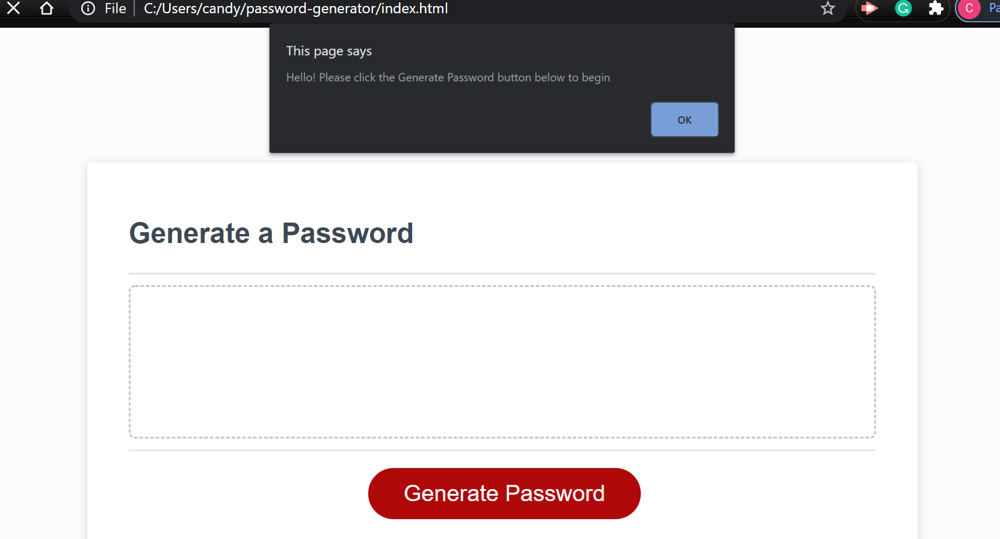

# password-generator

* I did not change the HTML file.  

* I started by declaring all the vars to identify them and clearly organizing the code with the appropriate ID’s  

* I learned about .split after struggling with the string of numbers, letter, and chatracters, but it really helped once I used it. 

* I had a really hard time getting the pw to generate, and I think it was because I was not defining the pwLength properly.

* The prompts and alerts worked properly immediately.  

* The upper, lower, numeric, and special characters are console.logging accurately.  

* The create PW function is giving me a really hard time.  

* Finally got the generatePassword function to work. It seems I had not declared the value of pwlength properly and also had not passed the variable through into the function. My tutor helped me identify this problem and solve it. 

* I tried commenting what I was trying to do for each section to keep the code organized and easy to read. If there is a better way or more effcient/clean way to do this please let me know

* Link to my deployed application: https://candygarcia014.github.io/password-generator/ 

* screenshot of my deployed application: 

 

* I appreiate your feedback :) 
 

 

  